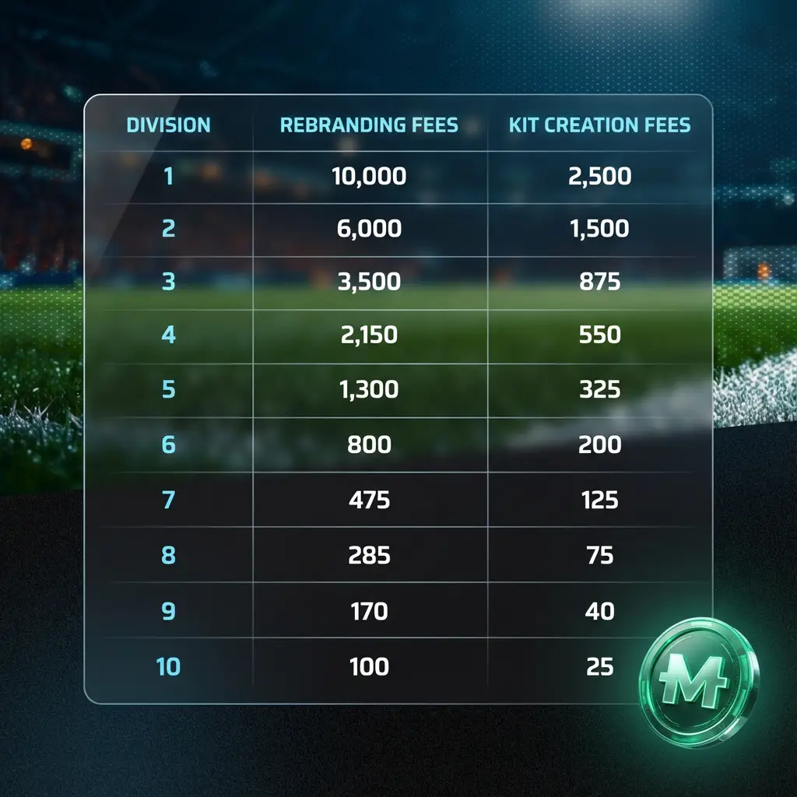

# Creating a Club

## Making it Yours

Those who were fortunate enough to obtain a [Club License](acquiring-a-club.md) will be able to begin their journey as Club Owners. To get started, one must first establish the following.

* **Name**\
  Enter your club's name.
* **Logo**\
  Upload your own logo or use the built-in Logo Creator tool to design one.
* **Background information**\
  Write a small description of your club's identity or history.
* **Colors**\
  Select the primary and secondary colors your club will sport.
* S**tadium Name**\
  **Pick a** name **for your home ground.**
* **Home and Away kit designs**\
  Choose a design for the kits your players will wear from a selection of patterns.

We reserve the right to change or remove names and logos that are deemed offensive or that use copyrighted material.


As a reminder, each club's geographic location is pre-determined and included in the club license. We may introduce geographically restricted [Competitions](../../game-mechanics/competitions/) in the future.


## Rebranding


Renaming, rebranding, or relocating a club incurs a fee, which is higher for better-ranked clubs. There may be limitations on how frequently a club's information can be changed.


Club owners who have changed their minds or who have just acquired a club on the secondary market will be able to update their club's details.&#x20;

So when you feel it's time to freshen up the branding or have brand new kits for the upcoming season, you can do so. All of the details listed above can be altered.

#### $MFL Fees

<figure><figcaption></figcaption></figure>

_Note: Every club owner gets one free rebrand when they acquire their first club – whether it comes from a trial upgrade, a pack, or the Marketplace._

_Information pertaining to the management of clubs can be found in later sections, starting with_ [_Team Management_](../../game-mechanics/team-management/)_._
