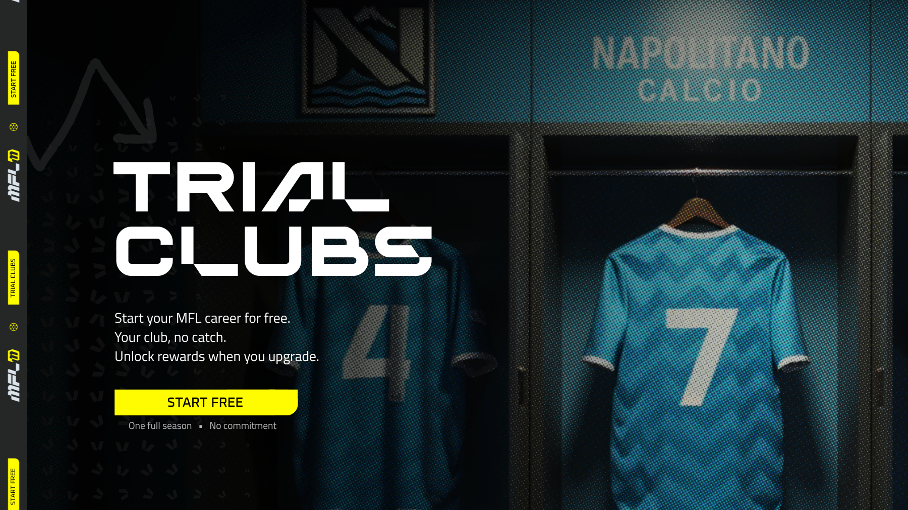

# Getting a Trial Club

<figure><figcaption></figcaption></figure>

**Trial Clubs** let new managers experience the full MFL ecosystem for one complete season – completely free. They provide a way to play, learn, and compete before committing to club ownership.\
\
To get yours, simply click on Create My Club on the homepage, discover where your club will be based, and define its identity!&#x20;

#### Overview

* Available **only to managers who have never owned a club**.
* Each manager can create **one Trial Club**.
* The club exists for **a single season** (league and cup).
* At season’s end, the manager can **purchase** it to keep progress, or let it expire.

#### Gameplay Access

* Full access to **fixtures, cups, transfer window, contracts, tactics, and match simulations**.
* Earn **$MFL rewards** from performances. Rewards stay locked until the club is purchased.
* Trial Clubs compete in the **lowest division (Flint)** and can earn promotion, which only applies if purchased.

#### Contract & Economy Rules

* Trial Clubs can offer up to **30% total revenue share** across their roster.
* Each contract is limited to **3% revenue share (including clauses)**.
* Max. **3 contracts** with the same agent.
* Clubs are **off-chain** and **non-tradable** until purchased.
