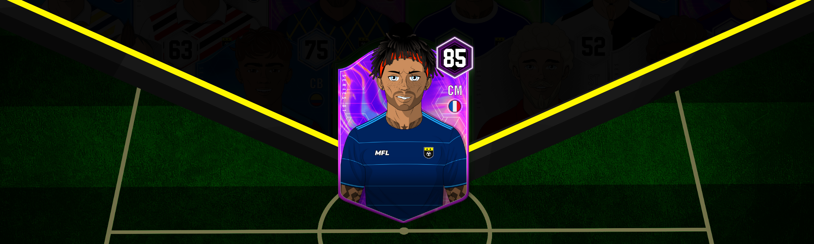

# Players

<figure><figcaption></figcaption></figure>

When generated, each MFL player is randomly assigned visual traits, personal information, and attributes. Because of the millions of possible combinations during the minting process, each player is guaranteed to be a unique NFT.

Players are dynamic assets that evolve and follow different career arcs depending on their characteristics and interactions with MFL users.

They rely on their Agents and Club Owners to train, develop, find a club, and negotiate contracts.
