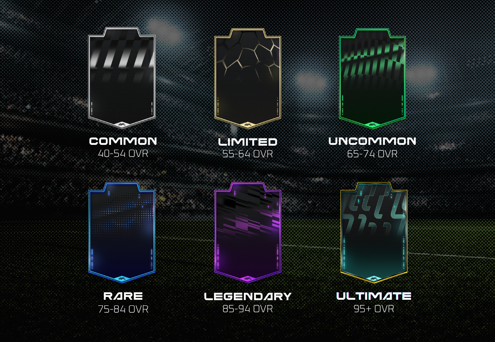

# Attributes and Rarity

The second and more intriguing aspect of a player's profile is an evaluation of their abilities in the form of Attributes. The ratings influence players' performance on the pitch and define which rarity tier they belong to.&#x20;

## Attributes

There are six core attributes in MFL. Players are assigned a rating, ranging from 0 to 99, that indicates their level of skill for each of these attributes at any given point in time.\
Depending on the player's position on the pitch, the attributes are given varying degrees of importance when calculating the _OVERALL_ rating. For instance, a Striker's _SHOOTING_ rating weighs more toward his _OVERALL_ rating than his _DEFENSE_ rating.


The [Marketplace ](../../economy/marketplace.md)allows you to filter through attribute ratings. You'll also be able to view any player's attributes in the game. Need a great passer to control the tempo in the midfield? Or a tough defender to set the tone for your back line? Scouting has never been easier!


<figure><figcaption>
A Rare Left-Back's card, with attribute ratings
</figcaption></figure>

| Attribute       | Description                                                                                    |
| --------------- | ---------------------------------------------------------------------------------------------- |
| OVERALL (OVR)   | Weighted average of a player's attributes, depending on position.                              |
| PACE (PAC)      | Indicates how fast a player can move on the pitch.                                             |
| SHOOTING (SHO)  | Reflects a player's ability to shoot the ball, and convert shots into goals.                   |
| PASSING (PAS)   | Illustrates a player's passing and crossing accuracy.                                          |
| DRIBBLING (DRI) | Represents a player's ball-control skills, and ability to evade tackles or get past opponents. |
| DEFENSE (DEF)   | Denotes a player's overall defensive prowess and ability to win the ball back or block shots.  |
| PHYSICAL (PHY)  | Indicates a player's endurance, ability to pressure opponents and win duels.                   |


Later iterations of the game may include sub-attributes that reflect a player's level of competency in more specific areas of the game. In future versions, a player's Pace rating could, for example, be calculated by averaging his Speed and Acceleration sub-attributes.


You can find below, the table detailing the calculation of the _OVERALL_ rating based on the other attributes ratings:&#x20;

<figure><figcaption>
<em>OVERALL</em> rating
</figcaption></figure>

## Rarity tiers

The _OVERALL_ rating is the single determining element used to establish a player's rarity tier, as depicted below.

<figure><figcaption>
<em>Rarity tier designs and OVR ranges</em>
</figcaption></figure>

Here are rough guidelines on the distribution per rarity when new players are generated.

<table><thead><tr><th width="175">Rarity Tier</th><th width="163">OVERALL (OVR)</th><th>% of Supply</th></tr></thead><tbody><tr><td>Ultimate</td><td>95+</td><td>None generated</td></tr><tr><td>Legendary</td><td>85-94</td><td>&#x3C; 0.4%</td></tr><tr><td>Rare</td><td>75-84</td><td>&#x3C; 4%</td></tr><tr><td>Uncommon</td><td>65-74</td><td>~17%</td></tr><tr><td>Limited</td><td>55-64</td><td>~35%</td></tr><tr><td>Common</td><td>40-54</td><td>~44%</td></tr></tbody></table>


The supply percentages per rarity tier provided in the above table are indicative only and will change as players progress.

