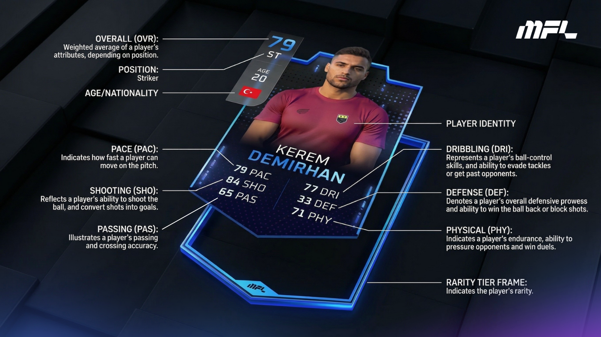

# Identity

MFL Player profiles contain the identification details that set them apart visually and administratively.

## Appearance

The first—and most striking—layer of a player's identity is his appearance. MFL players are generated with our own proprietary AI pipeline, ensuring each of them is completely unique.


These features are purely cosmetic and will not affect gameplay in any way.


## Personal Information

Up next is the players' personal information. These characteristics are also given to players at random during the minting process.

<figure><figcaption>
Personal details are also allocated randomly
</figcaption></figure>

### Name and Nationality

Names and nationalities are generated randomly and taken from real datasets. We used the Top 50 countries in the FIFA world rankings at the time of creation to determine which ones would originally be represented, and at what scale. The top real-world footbal**l** nations have a larger pool of players in MFL, while lower-ranked countries have fewer. \
We may add more nationalities to the ecosystem in future player drops.&#x20;

### Age and Height

* **Age**\
  Packs in the Player Drops feature players 16 to 28 years old. \
  However, the chances of getting players at either end of that spectrum are fairly low. A majority of players are 23-24 or younger when generated.\
  This is subject to change and we will review the probabilities before each Player Drop.
* **Height**\
  Height data is stored in centimeters. At present, the average MFL player height is 181cm, with a maximum height of 206cm. Height has a minor impact on gameplay, mostly affecting aerial duels and the reaching ability of goalkeepers.

### Position(s) and Preferred Foot

* MFL players have a primary [position](positions.md), which is the first one listed on their profile. The primary position also makes an appearance on the card design.&#x20;
* They may have up to two secondary positions listed on their profile. Players will feel more at ease—and perform slightly better—when playing in their primary position rather than one of their secondary positions.&#x20;
* Players are also given a preferred foot which indicates whether they tend to prioritize their right or left foot when passing, shooting, or dribbling. This will not affect gameplay initially, but likely will play a part in the future as the game engine becomes more advanced and complex.
