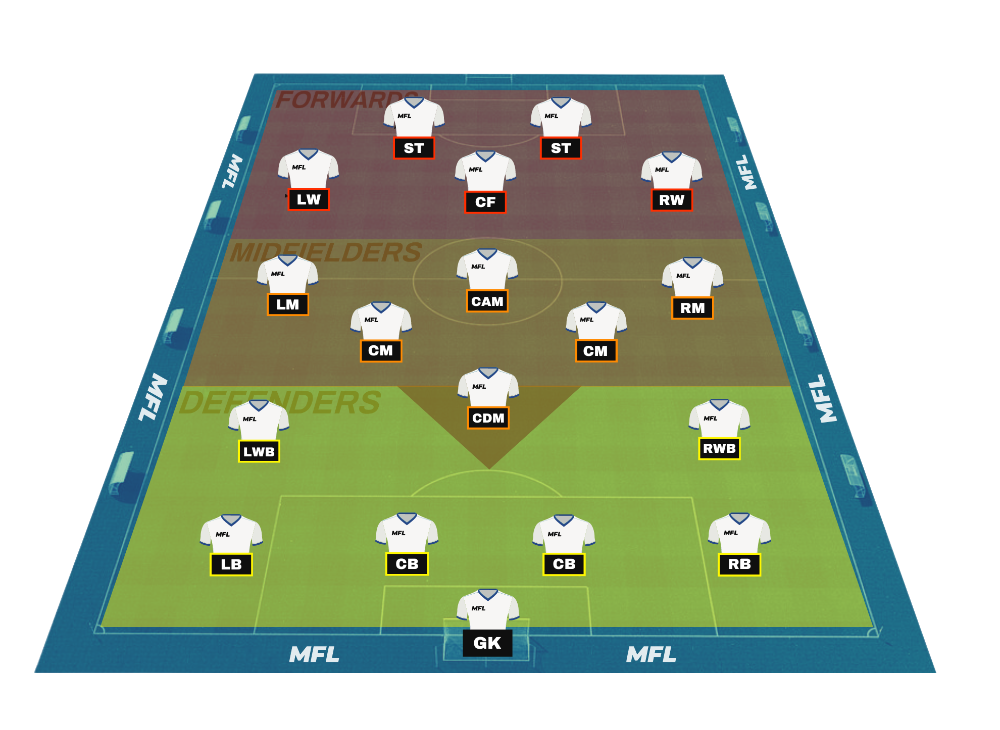
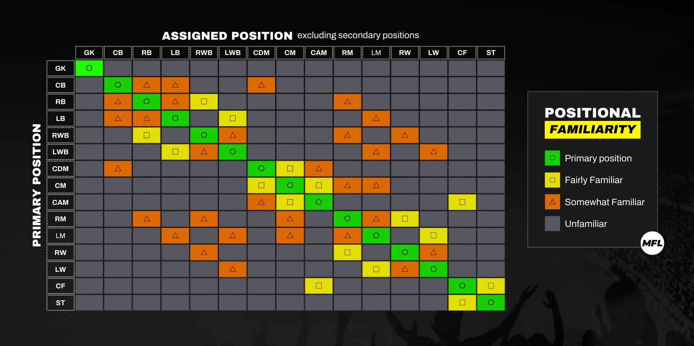
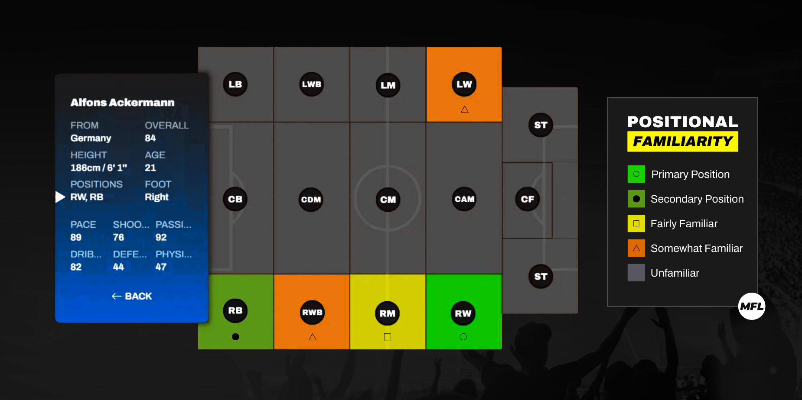

# Positions

The eleven players on each team are assigned a position on the pitch. Depending on the formation selected by the manager, the ten outfield players fill different defensive, midfield, and attacking roles.&#x20;


As you'll see below, MFL players perform better in certain positions. It's up to you to find the ideal combination and assemble the best starting eleven you can!


## Position types and abbreviations

Aside from Goalkeepers (GK), football positions fall under three main categories: Forwards, Midfielders and Defenders. Below is the list of all the positions used in MFL in each of these categories.



* **ST**: Striker
* **CF**: Centre Forward
* **LW**: Left Winger
* **RW**: Right Winger



* **CAM**: Central Attacking Midfielder
* **LM**: Left Midfielder
* **RM**: Right Midfielder
* **CM**: Centre Midfielder
* **CDM**: Defensive Midfielder



* **CB**: Centre-back
* **LWB**: Left Wing-back
* **RWB**: Right Wing-back
* **LB**: Left-back
* **RB**: Right-back



<figure><figcaption>
MFL Player positions on the pitch
</figcaption></figure>

## Positional Familiarity

As discussed in [Basic Information](identity.md), players are generated with a primary position and up to two secondary positions.&#x20;

While they can still excel in their secondary roles, players will perform slightly better in their primary position. \
If they are assigned a role on the pitch that isn't listed on their profile, though, players won't perform as well and their attribute ratings will suffer. Players are able to occupy different positions with varying degrees of success depending on the similarity between their primary and assigned positions.

For example, a player whose primary position is Right Winger should be able to hold his own in a Right Midfielder role—and perform at an acceptable level for his standards. \
If asked to play as a Centre Back, however, that player would likely struggle mightily.

<figure><figcaption>
The positional familiarity matrix, based on a player’s primary position.
</figcaption></figure>

* Secondary/Third position: -1 to every attribute
* Fairly Familiar: -5
* Somewhat Familiar: -8
* Unfamiliar: -20

And here is what it would look like for our friend Alfons, who is a Right Winger with Right Back as his secondary position. As you can see below, the positions similar to a player's secondary position are not given any advantage. Alfons would not benefit from playing as a CB or LB even though his secondary position is RB.

<figure><figcaption></figcaption></figure>


Some players have a higher _OVERALL_ rating when assigned one of their secondary positions. Because of positional familiarity, those players may or may not end up _performing_ better in their secondary position. This phenomenon is likely to occur more often as players progress and their ratings evolve.&#x20;

