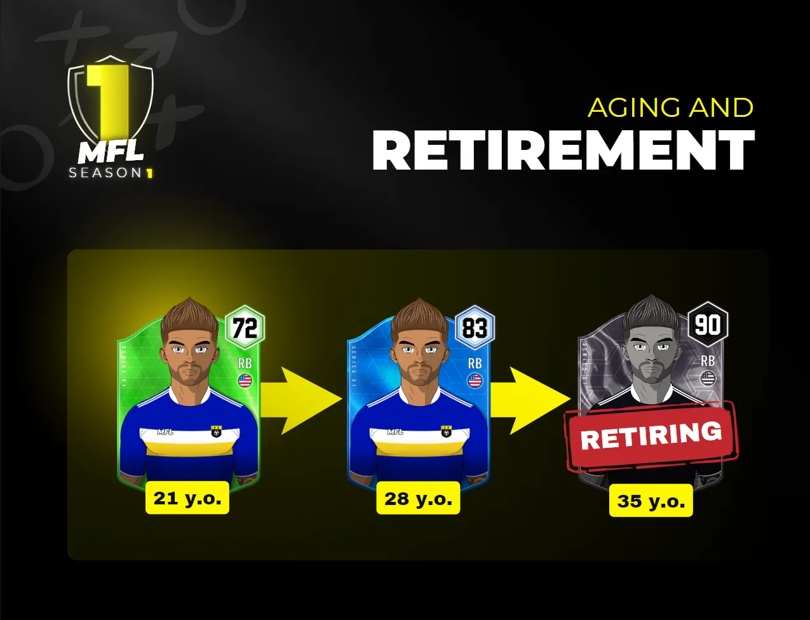

# Potential and Longevity

Two additional values, which determine their potential and longevity, are randomly assigned to players upon creation. In contrast to the aforementioned core skills, the rating allocated to each of these attributes cannot change over time and is not visible to users. They are sometimes referred to as "hidden" attributes.

### POTENTIAL (POT)

_POTENTIAL_ represents the highest possible _OVERALL_ rating a player can achieve. Players with a higher _POTENTIAL_ rating will be able to improve at a faster pace. The POT rating ranges from 0 to 99.\
You can skip ahead to [Player Development](../../game-mechanics/player-management/player-development.md) to learn more about that.

### LONGEVITY (LON)

_LONGEVITY_ relates to how long a player may maintain peak performance before their abilities deteriorate. Players with a high _LONGEVITY_ rating will enjoy longer careers. The LON rating can range from 0 to 10.


To determine which players are truly worth investing in, you must first get to know them; nonetheless, only time will tell if your instincts were right!


<figure><figcaption>
Example of an MFL Player's career progression
</figcaption></figure>

## Aging in MFL: Time Waits for No Player 

Starting from Season 1, **players will age by one year after each season**. Every season, players inch closer to retirement, making it crucial for managers to monitor their performance and fitness closely. This change means managers must think strategically about how to balance the experience of veteran players with the energy of younger talents.

### Longevity, the Hidden Clock 

Each player has a **hidden Longevity (LON) attribute**, ranging from **0 to 10**, which determines their **retirement age** — from **32 to 42 years old**. For instance, a player with a **Longevity of 2** will retire when he turns **34** (i.e. at the end of the season during which he was 33). The exact LON value won’t be revealed until the player announces their retirement, adding an element of mystery and strategy to the game. Managers will need to watch for signs of aging without knowing the precise retirement date too far in advance.

## Retirement Announcements: A Farewell Tour 

**Three seasons before retirement**, signs of aging start to show on the pitch, and are displayed in the interface, giving managers time to plan for their replacement. E**nergy starts to deplete faster**, and **recovery slows.** \
\
The closer they get to their final season, the more this will be amplified. Three seasons before retirement, the player may need slightly more regular resting time, but the impact of aging on fitness is still limited. During their final season, players’ **energy will decrease significantly faster**, and their **recovery rate** will be notably lower. The season becomes a balancing act of making the most of their remaining games while managing their stamina.

Exact percentages or numbers for these declines of energy won’t be displayed.

## Contracts and Retirement: What Happens Next? 

Players **cannot play or sign a new contract** after their final season. Their contracts automatically end when the season concludes, allowing managers to make plans for their squad’s future. For now, retired players won’t have any additional roles or utility in the game, though this may change in the future. Until then, their impact and legacy live on through the memories of their performances and accolades.


We are hoping to eventually allow players to transition into a career in football operations after they retire in future iterations of the game. As a result, some retired players would retain utility by contributing to the success of clubs as a coach or scout, for example.&#x20;


## FAQ 

* _**What about players that are hidden in packs? Do they age?**_\
  Yes, even when hidden in packs, players age, with one exception.\
  Players in the MFL account — like those minted for future drops or reserved for the MFL Store Reward Packs — do not.
* _**What’s the most common retirement age?**_\
  The Longevity (LON) attribute distribution follows a classic bell curve. Most players will retire between the ages of 34–36, while a lesser percentage will hang up the boots on either end of that range.

 
