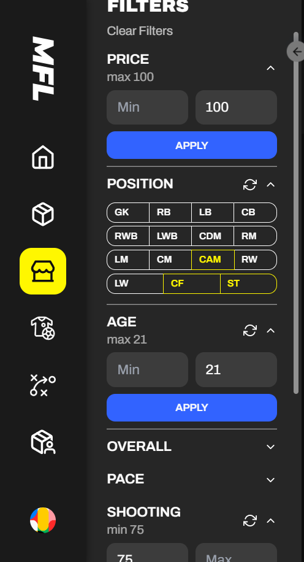
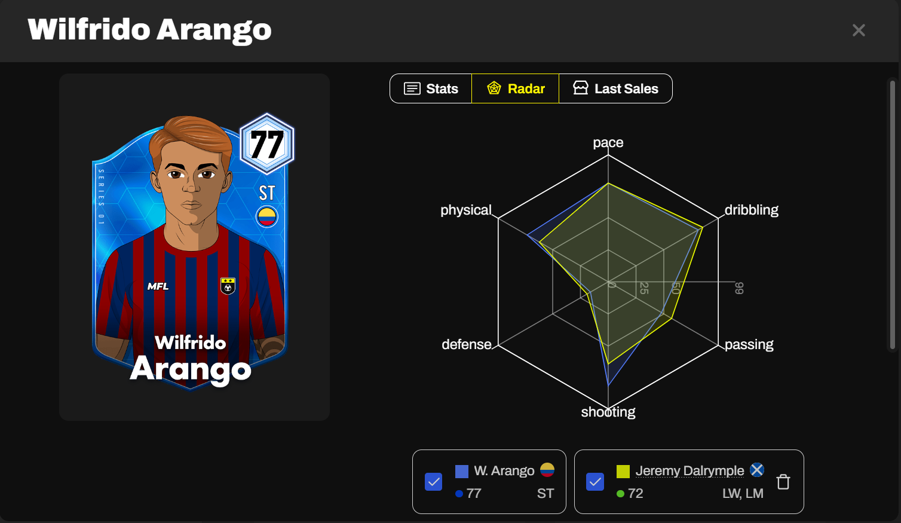

# Marketplace

The MFL Marketplace is a one-stop shop for buying and selling MFL assets. Holders will also be able to transact on external Flow marketplaces, such as Gaia or Rarible.

## Listing and Purchasing

### Find Hidden Gems

Prospective buyers have many filtering and sorting options, as well as the ability to view detailed information for each listed asset.

<figure><figcaption>
Some of the filtering options available
</figcaption></figure> <figure><figcaption>
You can use this comparison tool directly from within a player's profile
</figcaption></figure>

### List Assets

There will be two ways to list an asset for sale on the Marketplace.&#x20;



Simply set the price and confirm the listing. Your asset will be available for all to see, and purchase, on the Marketplace.&#x20;



#### Auction

To auction an asset off, users must set the following parameters:

* **Starting Price**: The price at which the auction starts, which is also the minimum amount the asset will sell for.
* **Listing Duration**: The duration of the auction.

It will also be possible to set a Buy Now price on Auction listings.\
When the auction concludes, and if the asset was not acquired via Buy Now, the user with the highest bid will take possession of it.&#x20;




Marketplace sales incur a 5% MFL fee and variable third party fees. The exact fee structure can be found on our Discord and is subject to change.&#x20;


## Offers

Users will be able to submit offers for the assets they wish to purchase. \
To submit an offer, the following parameters must be set:

* **Offer Price**: The price the buyer is willing to pay for the asset.
* **Offer Duration**: The duration of the offer.

The owner of the asset for which the offer was made will have the choice to accept or reject it. The offer will be automatically rejected if the owner doesn't respond in time.


Buy Now is presently the only available option for buying and selling on the Marketplace. Auctions and Offers will be developed at a later stage.&#x20;

