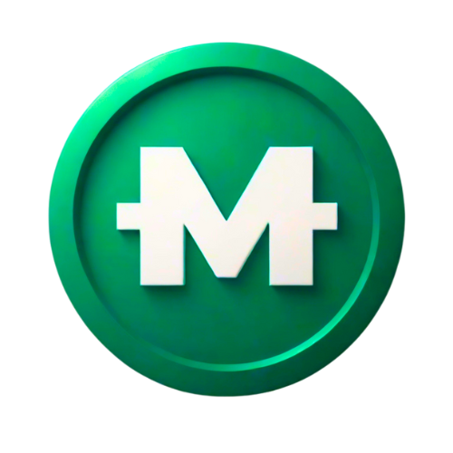

# $MFL

**MFL Coin ($MFL) is the in-game currency of MFL, which managers can earn through Competitions as well as player Contracts.**&#x20;

<figure><figcaption>
$MFL (MFL Coin), the in-game currency of MFL
</figcaption></figure>

## $MFL Facts

* It can be used to buy items, such as new players and packs, in the MFL Store. Some competitions may also require entry fees to be paid in $MFL.
* $MFL cannot be sold, transferred, or converted to another currency, and can only be acquired through gameplay.
* It is not listed on any exchanges and has an unlimited supply.
* The value of $MFL is determined by the cost of items in the MFL Store.


**800 $MFL is equivalent to $1 (USD) in value in the MFL Store.**&#x20;


<figure><figcaption></figcaption></figure>
