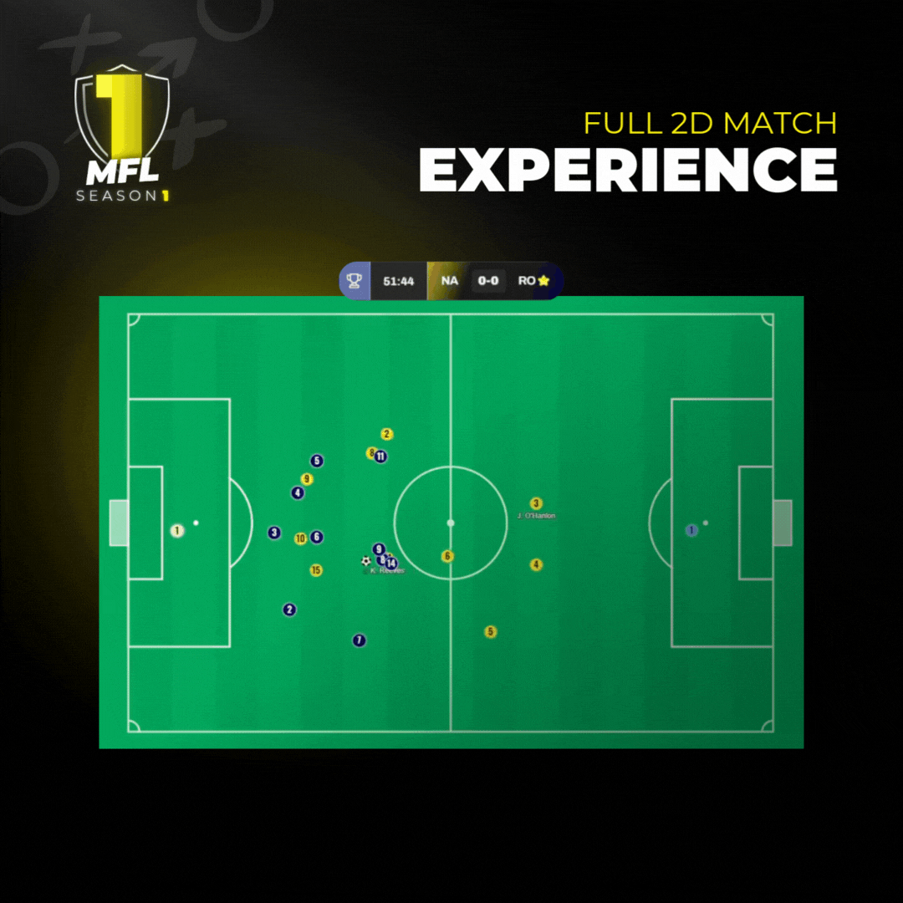

# Matches

In the end, what happens on the pitch is what really matters. It's where you will be able to see the fruits of your labor, and where legends are made.&#x20;

All of the aforementioned game components come to life during matches. Players' attributes, together with their conditioning levels, will heavily influence their performances. Training may pay off... or prove costly if the players are overworked. Employing the right tactics may help tip the scales to one side. Or perhaps team chemistry will end up being the deciding factor.


Friendly matches have no impact on player development or conditioning, but they can be useful for experimenting with new players or tactics!


## Follow Live or Watch Later!

Thanks to the anti-spoil feature, managers can watch their matches later while keeping the suspense alive. Or, enjoy the intensity of live matches and take in the action thanks to our immersive 2D Match Experience!

<figure><figcaption></figcaption></figure>

## The Sweet Spot

We believe that matches should be fun and entertaining—not just a formality. We also want a dynamic game, where users will sometimes have to play multiple matches in a day. Lastly, MFL should never feel like a grind, and we want users to be able to enjoy the full experience without having to spend an eternity glued to their screen to follow matches. Although it may be advantageous, users will not have to be present during matches. For those reasons, we came to the conclusion that a match duration of ten to fifteen minutes would be ideal.&#x20;


In the future, teams will have a tendency to perform slightly better on their home ground than away from home. This has not yet been implemented.


## Not so Predictable

Nothing is ever certain in football, and MFL is no exception. Having the best chance of winning is one thing; actually sealing the outcome is quite another. \
A player may happen to be in the best shape of his life and go on an absolute tear for a while. It might last just one match, and he might play horribly the next time around. Teams will be dealt injury blows that will change the course of their season. Upsets can happen and randomness will, at times, be a factor.
