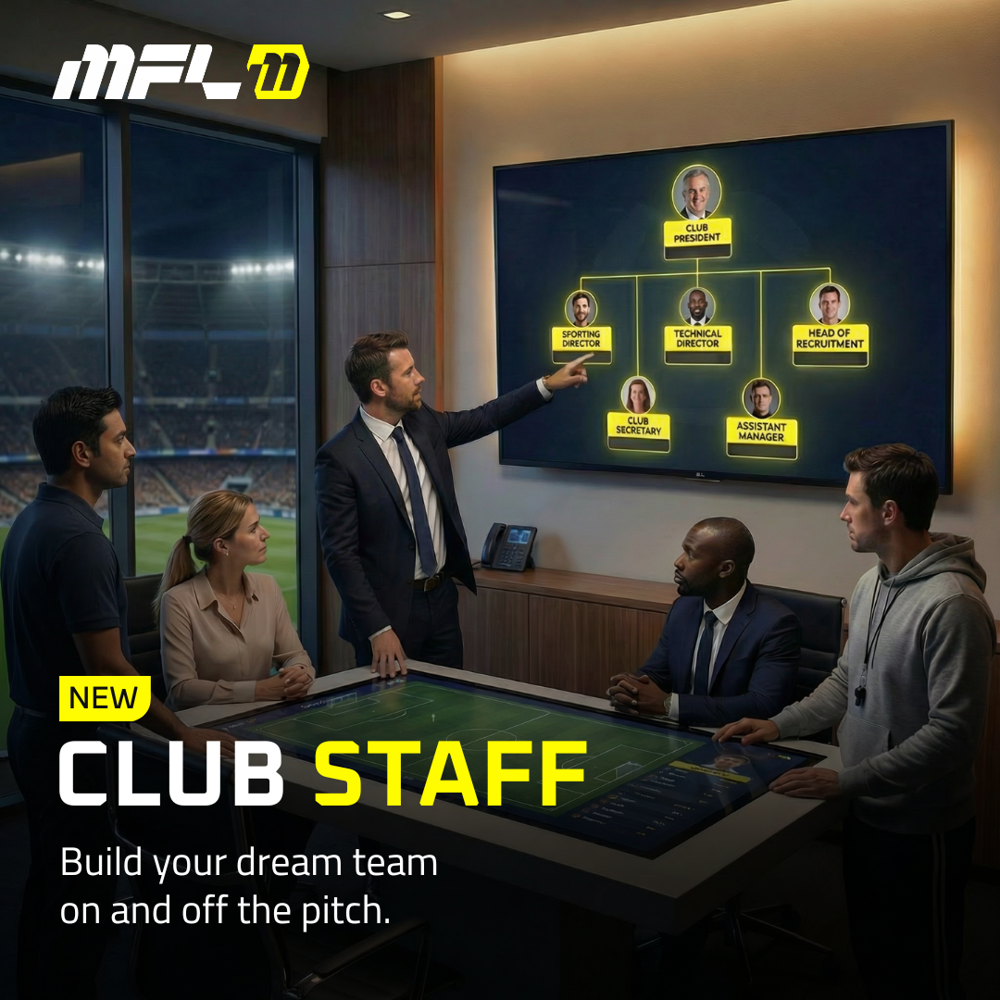

# Club Staff

This guide covers everything you need to understand about hiring, managing, and optimizing your backroom team.

<figure><figcaption></figcaption></figure>

### The Basics

#### What is Club Staff?

Club Staff allows club owners to hire other MFL managers as staff members who can help run their club. Each staff member receives a job title, specific permissions, and a share of club revenue in exchange for their contributions.

#### Key Parameters

* **Maximum staff per club:** 5
* **Each manager may be part of the staff** in up to 3 clubs
* **Contract duration:** 1 season (same as player contracts)
* **Revenue share:** Split from the same pool as players (0-100% total)

***

### Sending Staff Offers

#### The Invitation Process

To invite someone to your staff:

1. Navigate to the **Staff** tab in your club interface
2. Click **"Invite Staff Member"**
3. Enter the manager's username or wallet address
4. Configure the offer details
5. Send the invitation

The recipient will receive an email notification and can review the offer in their MFL interface.

#### When You Can Hire Staff

You can send staff offers and have them accepted at any point during the season until pre-contract agreements begin. Pre-contracts start the week after the midseason transfer window closes.

After this deadline, you cannot add new staff until the following season. However, existing staff contracts continue until the season ends.

**Important:** Revenue share is not prorated. A staff member who joins late in the season receives their full contracted percentage of season rewards, the same as someone who joined at the start. This ensures fair compensation regardless of signing timing.

#### Configuring the Offer

When creating a staff offer, you'll set four core elements:

**1. Job Title**

Select from nine preset titles:

* Manager
* Assistant Manager
* Sporting Director
* Technical Director
* Head of Football Operations
* Head of Recruitment
* Head of Brand
* Club Secretary
* Community Manager

The title is purely cosmetic and doesn't affect permissions. Choose one that reflects the responsibilities you're delegating.

**2. Permissions**

You can grant access to any combination of six permission categories:

* **Contract Offers:** Ability to send contract offers to players
* **Tactics:** Ability to modify team tactics, lineups, and formations
* **Competitions:** Ability to register for and manage competitions
* **Branding:** Ability to modify club logo, colors, and visual identity
* **Social:** Ability to generate club visuals
* **Contracts:** Ability to view and manage existing player contracts

Staff members can only perform actions in categories where they have explicit permission. All other areas of club management remain locked.

**3. Revenue Share**

Revenue share determines what percentage of your club's revenue this staff member will receive. This comes from the same pool as player revenue share.

**Important:** The total revenue share across all players AND staff cannot exceed 100%. If you've already allocated 80% to players, you can only offer up to 20% total across all staff members.

**4. Offer Duration**

Set how long this offer remains valid before it expires. This works the same as player contract offers - if the recipient doesn't accept within the specified timeframe, the offer expires and they can no longer accept it.

***

### Managing Your Staff

#### Reviewing Applications

When someone receives your staff offer, they'll see:

* Your club name and division
* The job title you've offered
* Contract duration (always 1 season)
* Revenue share percentage
* All permissions included
* A note that fees apply and are paid by the manager personally

They can then accept or decline. If they accept, the contract activates immediately.

#### Changing Permissions

This is where Club Staff gets interesting. You can modify any staff member's permissions at any time during their contract.

To adjust permissions:

1. Go to the Staff tab
2. Select the staff member
3. Click **"Edit"**
4. Toggle permissions on or off
5. Confirm changes

**Why this matters:** If a staff member isn't performing, becomes inactive, or breaks your trust, you can immediately revoke their access. They'll retain their title and revenue share (you must honor the contract), but they lose the ability to affect your club.

This creates a balanced system. Staff have financial security through guaranteed revenue share, but owners have operational security through revocable permissions.

#### Contract Termination

Contracts run for the full season unless both parties agree to cancel early. If you and your staff member both want to end the arrangement, you can mutually terminate the contract.

However, you cannot unilaterally break a staff contract. If the staff member wants to stay, you're committed to paying their revenue share for the entire season.

What you can do:

* Remove all their permissions (making them ceremonial)
* Choose not to renew when the season ends
* Set their revenue share to 0% in future offers

The requirement for mutual agreement protects staff from bad faith owners who might hire help for a crucial period then cut them loose without their consent.

With a maximum of 5 staff members, choose roles carefully based on what you actually need help with.

***

### Edge Cases and FAQs

**Q: What happens if a staff member stops playing MFL entirely?** \
A: They still receive their revenue share through the end of the season. You can revoke their permissions immediately to prevent any issues if they return unexpectedly.

**Q: Can I offer different staff the same job title?** \
A: Yes. Titles are purely cosmetic and don't need to be unique.

**Q: What happens to staff contracts when ownership changes?** \
A: Existing staff contracts remain in effect, but permissions are revoked. The new owner inherits all current staff and their obligations. To reinstate their duties, though, they need to edit the permissions.

**Q: Is there a cap on how much one staff member can earn?** \
A: No. You could theoretically give one staff member 100% of revenue share (though this would be unusual).

**Q: Can the same person be staff at multiple clubs?** \
A: Yes, they can be a staff member in up to three clubs, but not at multiple clubs within the same league.

***

### Getting Started

Ready to build your backroom team? Head to your club's Staff tab and send your first offer.

Your club is about to become something bigger than yourself. Make it count.
